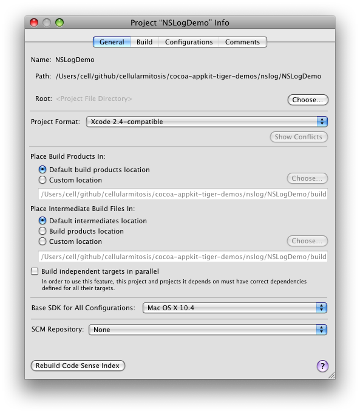

# cocoa-appkit-tiger-demos

Cocoa/AppKit demo projects, compatible with Xcode 2.5 / OS X 10.4 Tiger / PowerPC.

This is a scratch space while I learn how to develop Desktop applications for PowerPC Macs.

Specifically, I'm developing in Xcode 3.1.4 on OS X 10.5 Leopard,
but using 10.4 Tiger as the base SDK, and using the Xcode 2.4 project file format.

To configure a project to be compatible with Tiger / Xcode 2.5,
go to Project -> Edit Project Settings and:
- change the "Project Format" to "Xcode 2.4-compatible"
- chante the "Base SDK for All Configurations" to "Mac OS X 10.4"

